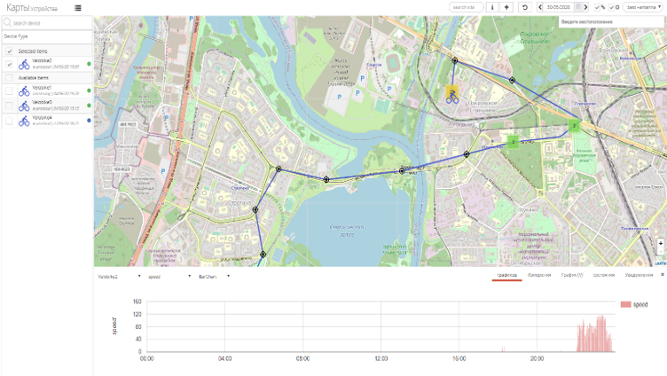

[TOC]

# Как создать учетную запись на платформе IoT-factory?

GitHub is a code hosting platform for version control and collaboration. It lets you and others work together on projects from anywhere.

This tutorial teaches you GitHub essentials like *repositories*, *branches*, *commits*, and *Pull Requests*. You’ll create your own Hello World repository and learn GitHub’s Pull Request workflow, a popular way to create and review code.

#### No coding necessary

To complete this tutorial, you need a [GitHub.com account](http://github.com/) and Internet access. You don’t need to know how to code, use the command line, or install Git (the version control software GitHub is built on).

> **Tip:** Open this guide in a separate browser window (or tab) so you can see it while you complete the steps in the tutorial.

# Как добавить умный датчик?

A **repository** is usually used to organize a single project. Repositories can contain folders and files, images, videos, spreadsheets, and data sets – anything your project needs. We recommend including a *README*, or a file with information about your project. GitHub makes it easy to add one at the same time you create your new repository. *It also offers other common options such as a license file.*

Your `hello-world` repository can be a place where you store ideas, resources, or even share and discuss things with others.

# Какие показатели указывать, когда создаешь дашборд?

1. In the upper right corner, next to your avatar or identicon, click and then select **New repository**.
2. Name your repository `hello-world`.
3. Write a short description.
4. Select **Initialize this repository with a README**.

**Branching** is the way to work on different versions of a repository at one time.

By default your repository has one branch named `main` which is considered to be the definitive branch. We use branches to experiment and make edits before committing them to `main`.

When you create a branch off the `main` branch, you’re making a copy, or snapshot, of `main` as it was at that point in time. If someone else made changes to the `main` branch while you were working on your branch, you could pull in those updates.

### To create a new branch

1. Go to your new repository `hello-world`.

2. Click the drop down at the top of the file list that says **branch: main**.

3. Type a branch name, `readme-edits`, into the new branch text box.

4. Select the blue **Create branch** box or hit “Enter” on your keyboard.

   

​    